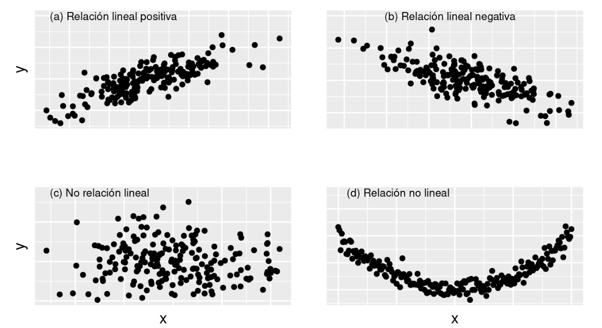

```{r setup, include=FALSE}
knitr::opts_chunk$set(echo = TRUE, comment = NA)
library(learnr)
library(ggplot2)
knitr::opts_chunk$set(echo = FALSE,
                 exercise.warn_invisible = FALSE)
# colores
c1="#FF7F00" # NARANJA COLOR PRINCIPAL
c2="#034a94" # AZUL FUERTE COLOR SECUNDARIO  
c3="#0eb0c6" # AZUL CLARO COLOR TERCEARIO  
c4="#686868" # GRIS COLOR TEXTO 
#library(PerformanceAnalytics)
#library(patchwork)
#-----------------------------------------------
##  <div class="content-box-blue">    </div> ## caja azul
```

## **PRESENTACIÓN**

```{r, echo=FALSE, out.width="100%", fig.align = "center"}
knitr::include_graphics("images/modulo1.png")
```

El presente tutorial contiene preguntas relacionadas con  el análisis de componentes principales. A continuación se presentan un resumen  con los principales conceptos:

</br>

### **CONCEPTOS**

El análisis de componentes principales (PCA) es una técnica ampliamente utilizada para reducir la dimensionalidad de un conjunto de datos mientras mantiene la mayor cantidad de información posible. Aquí están los principales conceptos asociados con el análisis de componentes principales:

<br/>

#### **Reducción de dimensionalidad**: 

PCA se utiliza para transformar un conjunto de datos de alta dimensionalidad en un espacio de menor dimensión, donde las nuevas variables (componentes principales) son combinaciones lineales de las variables originales. Esto ayuda a simplificar la interpretación y visualización de los datos.

<br/>

#### **Componentes principales**: 

Son las nuevas variables que resultan de la transformación realizada por PCA. Estas componentes están ordenadas en función de la cantidad de varianza que capturan en los datos. La primera componente principal captura la mayor varianza, la segunda componente principal captura la segunda mayor varianza y así sucesivamente.

<br/>

#### **Varianza**: 

Es una medida de dispersión de los datos alrededor de su media. Las componentes principales se seleccionan de manera que capturen la mayor cantidad posible de varianza en los datos originales.

<br/>

#### **Ortogonalidad**: 

Las componentes principales son ortogonales entre sí, lo que significa que no están correlacionadas. Esto asegura que las nuevas variables no tengan información redundante.

<br/>

#### **Eigenvector y Eigenvalor**: 

En el cálculo de PCA, se utilizan los eigenvectores y eigenvalores de la matriz de covarianza o matriz de correlación de los datos para obtener las componentes principales. Los eigenvectores son las direcciones de las componentes principales y los eigenvalores representan la cantidad de varianza que captura cada eigenvector.

<br/>

#### **Covarianza o Correlación**: 

Antes de aplicar PCA, es común estandarizar los datos (restar la media y dividir por la desviación estándar) para asegurar que todas las variables contribuyan por igual al análisis. Luego, se calcula la matriz de covarianza o correlación de los datos.

<br/>

#### **Explicación de la varianza**: 

Es importante evaluar cuánta varianza explica cada componente principal. La suma de las varianzas explicadas por todas las componentes principales da como resultado la varianza total de los datos. Esto permite determinar cuánta información se preserva al reducir la dimensión.

<br/>

#### **Número de componentes principales**: 

Una decisión crítica en PCA es determinar cuántas componentes principales retener. Se puede utilizar la "regla del codo" o el criterio de explicación de la varianza para seleccionar el número apropiado de componentes.

<br/>

#### **Aplicaciones**: 

PCA se utiliza en diversas aplicaciones, como reducción de dimensionalidad para visualización, compresión de imágenes, eliminación de correlación en datos antes de análisis de regresión, entre otros.

<br/>

#### **Limitaciones**: 

Aunque PCA es una técnica poderosa, también tiene sus limitaciones. Por ejemplo, puede no ser adecuado para datos con relaciones no lineales complejas, ya que busca relaciones lineales entre variables.

En resumen, el análisis de componentes principales es una herramienta valiosa para reducir la complejidad de conjuntos de datos de alta dimensión, permitiendo una mejor comprensión y análisis de la información.

</br>


```{r, echo=FALSE, out.width="100%", fig.align = "center"}
# 
```
 

## **CUESTIONARIO**

### **Pregunta 1**

```{r quiz_1}

quiz(
  question("¿Qué objetivo principal tiene el análisis de componentes principales (PCA)?", 
           correct = "Correcto!, (b) Realizar una proyección de los datos en un espacio de menor dimensión, por lo general en dos dimensiones.", 
           allow_retry = TRUE,
           answer("a) Reducir el tamaño de la muestra de datos.", message = "No...inténtalo de nuevo!"),
           answer("b) Realizar una proyección de los datos en un espacio de menor dimensión.", correct = TRUE),
           answer("c) Aumentar la complejidad de los datos para un mejor ajuste del modelo.", message = "Incorrecto. Intenta de nuevo!."),
           answer("d) Asegurar que los datos originales no se vean afectados por el análisis.", message = "No...inténtalo de nuevo!"),
           submit_button = "Enviar respuesta",
           try_again_button = "Intentar de nuevo"),
  caption = "  "
)

```

### **Pregunta 2**

```{r quiz_2}

quiz(
  question("¿Cuál de las siguientes afirmaciones es cierta acerca de las componentes principales?",
           correct = "Correcto|, (b) Los componentes principales resultantes son ortogonales o independientes (perpendiculares entre sí).",
           allow_retry = TRUE,
           answer("a) Son iguales a las variables originales del conjunto de datos.", message = "No...inténtalo de nuevo!"),
           answer("b) Son perpendiculares entre sí.", correct = TRUE),
           answer("c) Son útiles solo para conjuntos de datos bidimensionales.", message = "Incorrecto. Intenta de nuevo!."),
           answer("d) No están relacionadas con la varianza de los datos.", message = "No...inténtalo de nuevo!"),
           submit_button = "Enviar respuesta",
           try_again_button = "Intentar de nuevo"),
  caption = "  "
)


```

### **Pregunta 3**

```{r quiz_3}

quiz(
  question("¿Qué propiedad de las componentes principales las ordena según su importancia?",
           correct = "Correcto!, (a) Los componentes principales son ordenados por magnitud de la varianza que representan, de mayor a menor.",
           allow_retry = TRUE,
           answer("a) Magnitud de la varianza que representan.", correct = TRUE),
           answer("b) Cantidad de datos que explican.", message = "No...inténtalo de nuevo!"),
           answer("c) Número de variables originales que incluyen.", message = "Incorrecto. Intenta de nuevo!."),
           answer("d) Promedio de la correlación con otras componentes.", message = "No...inténtalo de nuevo!"),
           submit_button = "Enviar respuesta",
           try_again_button = "Intentar de nuevo"),
  caption = "  "
)

```

### **Pregunta 4**

```{r quiz_4}

quiz(
  question("Si utilizamos PCA para reducir la dimensión de un conjunto de datos, ¿qué información perdemos?",
           correct = "Correcto!, (c) Algunos detalles y ruido presentes en los datos originales.",
           allow_retry = TRUE,
           answer("a) La media y la varianza de las variables originales.", message = "No...inténtalo de nuevo!"),
           answer("b) La media y la desviación estándar de las variables originales.", message = "No...inténtalo de nuevo!"),
           answer("c) Algunos detalles y ruido presentes en los datos originales.", correct = TRUE),
           answer("d) La correlación entre las variables originales.", message = "Incorrecto. Intenta de nuevo!."),
           submit_button = "Enviar respuesta",
           try_again_button = "Intentar de nuevo"),
  caption = "  "
)


```


### **Pregunta 5**

```{r quiz_5}

quiz(
  question("¿Cuál es una ventaja clave del análisis de componentes principales?",
           correct = "Correcto!, (a) Aumenta la interpretación de los datos originales, permitiendo representar los registros en un plano cartesiano.",
           allow_retry = TRUE,
           answer("a) Aumenta la interpretación de los datos originales.", correct = TRUE),
           answer("b) Mantiene inalterados los tamaños de los conjuntos de datos.", message = "No...inténtalo de nuevo!"),
           answer("c) No requiere cálculos matemáticos complejos.", message = "Incorrecto. Intenta de nuevo!."),
           answer("d) Permite identificar outliers de manera efectiva.", message = "No...inténtalo de nuevo!"),
           submit_button = "Enviar respuesta",
           try_again_button = "Intentar de nuevo"),
  caption = "  "
)


```


### **Pregunta 6**

```{r quiz_6}

quiz(
  question("¿Cuál es el resultado de aplicar PCA a un conjunto de datos con 100 observaciones y 10 variables?",
           correct = "Correcto!, (b) Se obtienen 10 componentes principales, ordenados por la magnitud de la varianza que explica cada uno.",
           allow_retry = TRUE,
           answer("a) Se obtienen 100 componentes principales.", message = "No...inténtalo de nuevo!"),
           answer("b) Se obtienen 10 componentes principales.", correct = TRUE),
           answer("c) Se obtiene un único componente principal.", message = "Incorrecto. Intenta de nuevo!."),
           answer("d) El número de componentes principales depende de la varianza de los datos.", message = "No...inténtalo de nuevo!"),
           submit_button = "Enviar respuesta",
           try_again_button = "Intentar de nuevo"),
  caption = "  "
)


```


### **Pregunta 7**

```{r quiz_7}

quiz(
  question("¿Qué transformación realiza PCA sobre los datos originales antes de calcular las componentes principales?",
           correct = "Correcto!, (a) Escalamiento de los datos a una media de cero y desviación estándar de uno.",
           allow_retry = TRUE,
           answer("a) Escalamiento de los datos a una media de cero y desviación estándar de uno.", correct = TRUE),
           answer("b) Reemplazo de los valores faltantes por ceros.", message = "No...inténtalo de nuevo!"),
           answer("c) Reducción de la dimensión del conjunto de datos.", message = "Incorrecto. Intenta de nuevo!."),
           answer("d) Aplicación de un algoritmo de clasificación.", message = "No...inténtalo de nuevo!"),
           submit_button = "Enviar respuesta",
           try_again_button = "Intentar de nuevo"),
  caption = "  "
)


```

### **Pregunta 8**

```{r quiz_8}

quiz(
  question("¿Cuál es una desventaja potencial del análisis de componentes principales?",
           correct = "Correcto!, (b) Puede ser sensible a outliers presentes en los datos.",
           allow_retry = TRUE,
           answer("a) No se puede aplicar a conjuntos de datos con más de dos dimensiones.", message = "No...inténtalo de nuevo!"),
           answer("b) Puede ser sensible a outliers presentes en los datos.", correct = TRUE),
           answer("c) No permite reducir la complejidad de los modelos de aprendizaje automático.", message = "Incorrecto. Intenta de nuevo!."),
           answer("d) Solo es útil para conjuntos de datos con distribuciones normales.", message = "No...inténtalo de nuevo!"),
           submit_button = "Enviar respuesta",
           try_again_button = "Intentar de nuevo"),
  caption = "  "
)


```

### **Pregunta 9**

```{r quiz_9}

quiz(
  question("¿Qué porcentaje de varianza explicada es recomendable tener en cuenta al seleccionar las primeras componentes principales?",
           correct = "Correcto!, (d) Al menos el 95%.",
           allow_retry = TRUE,
           answer("a) Al menos el 50%.", message = "No...inténtalo de nuevo!"),
           answer("b) Al menos el 25%.", message = "No...inténtalo de nuevo!"),
           answer("c) Al menos el 80%.", message = "Incorrecto. Intenta de nuevo!."),
           answer("d) Al menos el 95%.", correct = TRUE),
           submit_button = "Enviar respuesta",
           try_again_button = "Intentar de nuevo"),
  caption = "  "
)


```


### **Pregunta 10**

```{r quiz_10}

quiz(
  question("¿Cuál es una aplicación común del análisis de componentes principales?",
           correct = "Correcto!, (c)) Reducir la dimensión de conjuntos de datos para visualización.",
           allow_retry = TRUE,
           answer("a) Generar datos sintéticos aleatorios.", message = "No...inténtalo de nuevo!"),
           answer("b) Clasificar imágenes en diferentes categorías.", message = "No...inténtalo de nuevo!"),
           answer("c) Reducir la dimensión de conjuntos de datos para visualización.", correct = TRUE),
           answer("d) Realizar predicciones de series temporales.", message = "Incorrecto. Intenta de nuevo!."),
           submit_button = "Enviar respuesta",
           try_again_button = "Intentar de nuevo"),
  caption = "  "
)


```

