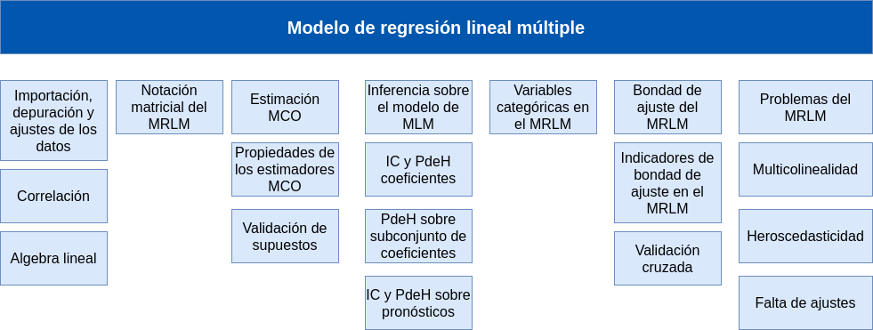

```{r setup, include=FALSE}
library(learnr)
knitr::opts_chunk$set(echo = FALSE,
                 exercise.warn_invisible = FALSE)
# colores
c1="#FF7F00" # NARANJA COLOR PRINCIPAL
c2="#034a94" # AZUL FUERTE COLOR SECUNDARIO  
c3="#0eb0c6" # AZUL CLARO COLOR TERCEARIO  
c4="#686868" # GRIS COLOR TEXTO 
##  <div class="content-box-blue">    </div> ## caja azul

# devtools::install_github("dgonxalex80/paqueteMODELOS", force = TRUE)
```

## **PRESENTACIÓN**

```{r, echo=FALSE, out.width="100%", fig.align = "center"}
knitr::include_graphics("images/modulo1.png")
```


El presente tutorial contiene preguntas relacionadas con los conceptos más importantes del modelo de regresión lineal múltiple y su presentación matricial, conceptos importante para la compresión del resto de la unidad.  

</br></br>

### **CONCEPTOS**

#### **Diagrama de dispersión**

herramienta gráfica, utili para la visualización de la relación que puede existir entre dos variables cuantitativas, basado en la forma que presenta la nube de puntos.

</br>

#### **Coeficiente de correlación** 

Corresponde al coeficiente de correlación de Pearson ($\rho$), mide la relación lineal existente entre dos variables cuantitativas.  $0 \leq \rho \leq 1$  

Con una muestra de datos $(x,y)$ podemos estimar este valor $\widehat{\rho}$, con el cual podemos realizar una prueba de hipótesis $Ho: \rho =0$  vs $Ha: \rho \neq 0$.  

</br>

#### **Forma matricial del MRL**

Para facilitar su escritura, operaciones e interpretación del MRLM, se trabaja la forma matricial del modelo:

$$Y = X \beta + \varepsilon$$
Donde :

* $Y$ : vector de valores de $y$, variable dependiente ($dim = n \times 1$)

* $X$ : matriz que contiene los valores de las $k$ variables independientes ($dim = n \times k$)

* $\varepsilon$ : vector de errores ($dim = n \times 1$)

Conformando un sistema de $n$ ecuaciones con $k+1$ incognitas ($\beta_{i}$, $i=0,1,2,\dots k$)

</br></br>

#### **Estimación MCO**

El resultado de la minimización de la suma de cuadrados de los errores (derivacón parcial de $S$ con respecto a $\beta$) 

$$S\left(\boldsymbol{\beta}\right) = \boldsymbol{\varepsilon}'\boldsymbol{\varepsilon}
\left(\boldsymbol{y} - \boldsymbol{X\beta}\right)'\left(\boldsymbol{y} - \boldsymbol{X\beta}\right)$$

da como resultado:

$$\boldsymbol{\widehat\beta} = \left(\boldsymbol{X}'\boldsymbol{X}\right)^{-1}\ \boldsymbol{X}'\boldsymbol{y}$$

</br></br>

#### **Supuestos del MRLM**

##### **Supuestos sobre los errores**

* **Normalidad de los errores**: Los errores son variables aleatorias normales. $e \sim normal$

* **Nodelo completo**: Los errores tienen media cero. $E[e] = 0$

* **Homoscedasticidad** :Los errores tienen varianza constante. $V[e] = \sigma^{2}$

* **No autocorrelación de errores** : Los errores son mutuamente independientes. $E[e_i, e_j] =0$


</br></br>

#### **MAPA** 
  

```{r, echo=FALSE, , out.width="100%", fig.align = "center"}
  

```

</br></br>

#### **CÓDIGO R**

| concepto                   | código                               |
|:---------------------------|:-------------------------------------|
| coeficiente de correlación |  `cor(x,y)`                            |
| matriz de dispersión       |  `plot(x,y)`                           |
| matriz correlaciones dispersión | `GGally::ggpairs(data)`  |
| estimacion MCO             |`lm(y ~ x1 + x2 + x3 , data = namedata)`|
| estimación Steppwise       | `modelo_b0<- lm(y ~ 1, data=namedata)`|
|                            | `modelo_all <- lm(y ~ x1 + x2 + x3, data=namedata)`|
| Validación de supuestos    |                                       |
| $e \sim normal$            | Shapiro-Wilk : `shapiro.test(x)`        |
|                            | Kolmogorow-Smirnov: `nortest::lillie.test(x)` |
|                            | Jarque-Bera : `normtest::ajb.norm.test(x)`    |
|                            | Anderson Darling : `nortest::ad.test(x)` |
| $E[e] = 0$                 | `t.test(x)`                                  |
| $V[e] = \sigma^{2}$        | Goldfeld-Quandt : `gqtest(y ~ x)`   |
| $E[e_i, e_j] =0$           | Durbin-Watson : `lmtest::dwtest(y ~ x)` |
|||


## **CUESTIONARIO**

### **Pregunta 1**

¿Cuál de las siguientes es la forma general de la ecuación del modelo de regresión múltiple? <br>

$( a ) \hspace{.3cm}$ $X_{i1} + \beta_2X_{i2} + \dots+ \beta_kX_{ik} + \varepsilon_i$ </br>

$( b ) \hspace{.3cm}$ $Y_i = \beta_0 + \beta_1X_{i1} + \beta_2X_{i2} + \dots+ \beta_kX_{ik} + \varepsilon_i$</br>

$( c ) \hspace{.3cm}$ $Y_i = \beta_0 + \beta_1X_{i1} + \beta_2X_{i2} + \dots+ \beta_kX_{ik}$</br>

$( d ) \hspace{.3cm}$ $Y_i = \beta_0^{2} + \beta_1^{2}X_{i1} + \beta_2^{2}X_{i2} + \dots+ \beta_k^{2}X_ {ik} + \varepsilon_i$</br>

```{r quiz_1}

quiz(
  question("  ", 
           correct = " Correcto!", 
           allow_retry = TRUE,
           answer("( a )", message = "No...intentalo de nuevo!"),
           answer("( b )", correct = TRUE),
           answer("( c )", message = "Incorrecto. Intenta de nuevo!."),
           answer("( d )", message = "No...intentalo de nuevo!"),
           # Si no cambiamos estos textos en los botones, se mostrarán en Inglés  
           submit_button = "Enviar respuesta",
           try_again_button = "Intentar de nuevo"),
  # Si no ponemos un caption aparecerá la palabra Quiz en inglés.
  caption = ""
)

```


### **Pregunta 2**

¿Cuál es la distribución de probabilidad de los errores de un modelo de regresión lineal? </br>

$( a ) \hspace{.3cm}$  $\epsilon_{i} \sim Normal(0, 1)$</br>

$( b ) \hspace{.3cm}$  $\epsilon_{i} \sim Uniforme(0, 1)$</br>

$( c ) \hspace{.3cm}$  $\epsilon_{i} \sim Normal(0, \sigma^2)$</br>

$( d ) \hspace{.3cm}$  Puede tomar cualquier distribución.</br>


```{r quiz_2}

quiz(
  question("  ", 
           correct = "Correcto! ", 
           allow_retry = TRUE,
           answer("( a )", message = "No...intentalo de nuevo!"),
           answer("( b )", message = "Incorrecto. Intenta de nuevo!."),
           answer("( c )", correct = TRUE), 
           answer("( d )", message = "No...intentalo de nuevo!"),
           # Si no cambiamos estos textos en los botones, se mostrarán en Inglés  
           submit_button = "Enviar respuesta",
           try_again_button = "Intentar de nuevo"),
  # Si no ponemos un caption aparecerá la palabra Quiz en inglés.
  caption = " "
)

```


### **Pregunta 3**

Cuales son los supuestos sobre los errores de un modelo de regresión lineal múltiple?

```{r quiz_3}

quiz(
  question(" ", 
           correct = "Correcto!", 
           allow_retry = TRUE,
           answer("Normalidad, independencia, varianza constante y media cero", correct = TRUE),
           answer("Normalidad, varianza heterogenea, independencia y media cero", message = "Nop...intentalo de nuevo!"),
           answer("No tienen supuestos ", message = "Incorrecto. Intenta de nuevo!."),
           answer("Normalidad y varianza constante", message = "Cerca, pero no...intentalo de nuevo!"),
           # Si no cambiamos estos textos en los botones, se mostrarán en Inglés  
           submit_button = "Enviar respuesta",
           try_again_button = "Intentar de nuevo"),
  # Si no ponemos un caption aparecerá la palabra Quiz en inglés.
  caption = " "
)

```

### **Pregunta 4**

La forma correcta de interpretar los coeficientes de regresión ${ \beta_j ~~donde\hspace{.3cm} j = 1, 2, \dots, k}$ es: </br>

$( a ) \hspace{.3cm}$ Indican el cambio en la respuesta media de ${Y}$ por unidad de incremento en el logaritmo de la respectiva variable ${X_j}$, cuando las demás predictoras permanecieron constantes. </br>

$( b ) \hspace{.3cm}$ Indican el cambio en la respuesta media de ${Y}$ por unidad de incremento en la respectiva variable ${X_j}$, cuando las demás predictoras permanecen constantes. </br>

$( c ) \hspace{.3cm}$ Indican el cambio en la respuesta media de ${Y}$ por unidad de incremento en la respectiva variable ${X_j}$, cuando las demás predictoras toman distintos valores no constantes.</br>

$( d ) \hspace{.3cm}$  Indican el cambio en la respuesta media de ${Y}$ por incremento del 200% en la respectiva variable ${X_j}$, cuando las demás 
predictoras permanecieron constantes. </br>

```{r quiz_4}

quiz(
  question(" ", 
           correct = "Correcto!", 
           allow_retry = TRUE,
           answer("( a )", message = "No...intentalo de nuevo!"),
           answer("( b )", correct = TRUE),  
           answer("( c )", message = "Incorrecto. Intenta de nuevo!."),
           answer("( d )", message = "No...intentalo de nuevo!"),
           # Si no cambiamos estos textos en los botones, se mostrarán en Inglés  
           submit_button = "Enviar respuesta",
           try_again_button = "Intentar de nuevo"),
  # Si no ponemos un caption aparecerá la palabra Quiz en inglés.
  caption = " "
)

```


### **Pregunta 5**

¿Qué sucede si existen relaciones lineales fuertes entre las variables predictoras?

```{r quiz_5}

quiz(
  question(" ", 
           correct = "Correcto. cuando existe una relación excta entre dos variables predictoras ( X_1 = 2*X_2 , no se pueden estimar los coeficientes", 
           allow_retry = TRUE,
           answer("Provocaria multicolinealidad dentro del modelo", correct = TRUE),
           answer("Se presentaría heterogeneidad en los residuos", message = "No...intentalo de nuevo!"),
           answer("Los coeficientes de regresión no tendrán interpretación", message = "Incorrecto. Intenta de nuevo!."),
           answer("Los errores no tendrán distribución normal" , message = "No...intentalo de nuevo!"),
           # Si no cambiamos estos textos en los botones, se mostrarán en Inglés  
           submit_button = "Enviar respuesta",
           try_again_button = "Intentar de nuevo"),
  # Si no ponemos un caption aparecerá la palabra Quiz en inglés.
  caption = " "
)

```


### **Pregunta 6**

Una forma cuadrática se puede expresar matricialmente como:</br>

$( a ) \hspace{.3cm}$ $\boldsymbol{xA}'\boldsymbol{x}$ </br>

$( b ) \hspace{.3cm}$ $\boldsymbol{xA}'\boldsymbol{xx}$ </br>

$( c ) \hspace{.3cm}$ $I\boldsymbol{Ax}$ </br>

$( d ) \hspace{.3cm}$ $\boldsymbol{x}'\boldsymbol{Ax}$</br>

```{r quiz_6}

quiz(
  question("", 
           correct = "Correcto!", 
           allow_retry = TRUE,
           answer("( a )", message = "No...intentalo de nuevo!"),
           answer("( b )" , message = "No...intentalo de nuevo!"),
           answer("( c )", message = "Incorrecto. Intenta de nuevo!."),
           answer("( d )", correct = TRUE), 
           # Si no cambiamos estos textos en los botones, se mostrarán en Inglés  
           submit_button = "Enviar respuesta",
           try_again_button = "Intentar de nuevo"),
  # Si no ponemos un caption aparecerá la palabra Quiz en inglés.
  caption = " "
)

```


### **Pregunta 7**

Por fuera de la diagonal de la matriz de varianzas-covarianzas asociadas a un vector aleatorio están:

$$
\boldsymbol{\Sigma_y} = V(\boldsymbol{y}) = \begin{bmatrix}
\sigma_{11} &\sigma_{12} &\cdots &\sigma_{1n}\\
\sigma_{21} &\sigma_{22} &\cdots &\sigma_{2n}\\
\vdots &\vdots &\ddots &\vdots\\
\sigma_{n1} &\sigma_{n2} &\cdots &\sigma_{nn}
\end{bmatrix}
$$

```{r quiz_7}

quiz(
  question("", 
           correct = "Correcto!", 
           allow_retry = TRUE,
           answer("Las variaciones asociadas a cada elemento del vector aleatorio.", message = "No...intentalo de nuevo!"),
           answer("Las esperanzas condicionales entre los pares de elementos del vector aleatorio.", message = "No...intentalo de nuevo!"),
           answer("Los coeficientes de correlaciones asociados a cada elemento del vector aleatorio.", message = "Incorrecto. Intenta de nuevo!."),
           answer("Las covarianzas entre los pares de elementos del vector aleatorio.", correct = TRUE),
           # Si no cambiamos estos textos en los botones, se mostrarán en Inglés  
           submit_button = "Enviar respuesta",
           try_again_button = "Intentar de nuevo"),
  # Si no ponemos un caption aparecerá la palabra Quiz en inglés.
  caption = "  "
)

```


### **Pregunta 8**

La base de datos ausentismo contenida en paqueteMOD contiene las siguientes variables:

* id : identificación del empleado
* ausen : número de dias que un empleado se ausenta del trabajo en el último año
* taller : toma el valor de 1 si el empleado trabaja en el taller y 0 si no 
* sexo : toma el valor de 1 si el empleado es un hombre y 0 si es una mujer
* edad : edad del empleado en años
* antg : antiguedad del empleado en la empresa
* sala : salrio del empleado

A partir de la siguiente matriz, cual de las variables aporta más a la explicación de la variabilidad de ausentismo?

```{r, comment=NA, echo=FALSE, message=FALSE, warning=FALSE}
library(paqueteMODELOS)
library(GGally)
data("ausentismo")
ggpairs(ausentismo, title=" ")
```


```{r quiz_8}

quiz(
  question("",
           correct = "Correcto!, presenta una correlación de -0.715, altamente significativa.",
           allow_retry = TRUE,
           answer("id", message = "Cerca, pero no...intentalo de nuevo!"),
           answer("sexo", message = "Nop...intentalo de nuevo!"),
           answer("edad", message = "Incorrecto. Intenta de nuevo!."),
           answer("antg", correct = TRUE),
           # Si no cambiamos estos textos en los botones, se mostrarán en Inglés
           submit_button = "Enviar respuesta",
           try_again_button = "Intentar de nuevo"),
  # Si no ponemos un caption aparecerá la palabra Quiz en inglés.
  caption = " "
)

```


<!-- ### **Pregunta 9** -->

<!-- ```{r quiz_9} -->

<!-- quiz( -->
<!--   question("¿Pregunta?",  -->
<!--            correct = "Respuesta y explicación!, .",  -->
<!--            allow_retry = TRUE, -->
<!--            answer("opción 1", message = "Cerca, pero no...intentalo de nuevo!"), -->
<!--            answer("opción 2", message = "Nop...intentalo de nuevo!"), -->
<!--            answer("opción 3", message = "Incorrecto. Intenta de nuevo!."), -->
<!--            answer("opción 4", correct = TRUE), -->
<!--            # Si no cambiamos estos textos en los botones, se mostrarán en Inglés   -->
<!--            submit_button = "Enviar respuesta", -->
<!--            try_again_button = "Intentar de nuevo"), -->
<!--   # Si no ponemos un caption aparecerá la palabra Quiz en inglés. -->
<!--   caption = "Visualización" -->
<!-- ) -->

<!-- ``` -->


<!-- ### **Pregunta 10** -->

<!-- ```{r quiz_10} -->

<!-- quiz( -->
<!--   question("¿Pregunta?",  -->
<!--            correct = "Respuesta y explicación!, .",  -->
<!--            allow_retry = TRUE, -->
<!--            answer("opción 1", message = "Cerca, pero no...intentalo de nuevo!"), -->
<!--            answer("opción 2", message = "Nop...intentalo de nuevo!"), -->
<!--            answer("opción 3", message = "Incorrecto. Intenta de nuevo!."), -->
<!--            answer("opción 4", correct = TRUE), -->
<!--            # Si no cambiamos estos textos en los botones, se mostrarán en Inglés   -->
<!--            submit_button = "Enviar respuesta", -->
<!--            try_again_button = "Intentar de nuevo"), -->
<!--   # Si no ponemos un caption aparecerá la palabra Quiz en inglés. -->
<!--   caption = "Visualización" -->
<!-- ) -->

<!-- ``` -->


## **PROBLEMAS**


### **Problema 1**

Para la base de datos vivienda, contenida en paqueteMOD, realice una exploración  de las variables cuantitativas :

* preciom      : precio de la vivienda
* areaconst    : area construida
* parqueaderos : número de parqueaderos
* banios       : número de baños
* habitaciones : número de habitaciones


```{r p1, exercise=TRUE, exercise.lines = 15}
library(paqueteMODELOS)
data(vivienda)

```


```{r p1-hint}
library(paqueteMODELOS)
data(vivienda)
summary(vivienda[,4:8])

```


```{r p1-solution}
library(paqueteMODELOS)
data(vivienda)
summary(vivienda[,4:8])
```


### **Problema 2**

Para la base de datos vivienda, contenida en paqueteMOD, realice una descripción de las variables cualitativas solo para tipo de vivienda apartamento :

* **zona** : ubicación del apartamento
* **piso** : piso de ubicación del apartamento
* **estrato** : estrato socio económico donde se encuentra la vivienda


```{r p2, exercise=TRUE, exercise.lines = 15}
library(paqueteMODELOS)
data(vivienda)
apartamentos=subset(vivienda, tipo=="Apartamento")
vivienda$zona = as.factor(vivienda$zona)

```


```{r p2-hint}
library(paqueteMODELOS)
library(summarytools)
data(vivienda)
apartamentos=subset(vivienda, tipo=="Apartamento")
summarytools::freq()
```


```{r p2-solution}
library(paqueteMODELOS)
data(vivienda)
apartamentos=subset(vivienda, tipo=="Apartamento")
summarytools::freq(apartamentos$zona, cumul = FALSE)
summarytools::freq(apartamentos$piso)
summarytools::freq(apartamentos$estrato)
```


### **Problema 3**

Para la base de datos vivienda, contenida en paqueteMOD, detecte si existen valores faltantes.  

```{r p3, exercise=TRUE, exercise.lines = 15}
library(paqueteMODELOS)
data(vivienda)

```


```{r p3-hint}
library(paqueteMODELOS)
data(vivienda)


```


```{r p3-solution}
library(paqueteMODELOS)
# library(heatmaply)
data(vivienda)
# detecta el número de datos NA por variable
apply(X = is.na(vivienda), MARGIN = 2, FUN = sum)
# heatmaply::heatmaply_na(vivienda)
dim(vivienda)

```


### **Problema 4**

Para la base de datos vivienda, contenida en paqueteMOD, Determine si existe una gran cantidad de datos faltantes (NA) en alguna de las variables de las variables , Dado que existe una gran cantidad de información excluya  todos los registros que contenga NAs. Cuantos registros quedan? 

```{r p4, exercise=TRUE, exercise.lines = 15}
library(paqueteMODELOS)
data(vivienda)

```


```{r p4-hint}
library(paqueteMODELOS)
data(vivienda)
viviendaSNA <- na.omit(vivienda)
apply(X = is.na(viviendaSNA), MARGIN = 2, FUN = sum)
dim(vivienda)
dim(viviendaSNA)
```


### **Problema 5**

Para la base de datos vivienda, contenida en paqueteMOD, estime las relaciones existentes entre las variables cuantitativas.  ¿Qué ocurre cuando cambianos la escala de las variables?

```{r p5, exercise=TRUE, exercise.lines = 15}
library(paqueteMODELOS)
data(vivienda)
```


```{r p5-hint, warning=FALSE, message=FALSE}
library(paqueteMODELOS)
library(GGally)
data(vivienda)
ggpairs(vivienda[,4:8], title=" ") 
```


```{r p5-solution, message=FALSE, warning=FALSE}
library(paqueteMODELOS)
library(GGally)
data(vivienda)
vivienda$preciom=log(vivienda$preciom)
vivienda$areaconst=log(vivienda$areaconst)
GGally::ggpairs(vivienda[,4:8], title=" ") 
```


### **Problema 6**

Alrevisar la  base de datos vivienda, contenida en paqueteMOD, Se detectó que en los registros se presenta una inconsistencia en la variable número de habitaciones. 

```{r,echo=FALSE,comment=NA}
summary(vivienda$habitaciones)
```

Solucione ambos problemas eliminando los registros con número de habitaciones  `habitaciones = 0`.


```{r p6, exercise=TRUE, exercise.lines = 5}
library(paqueteMODELOS)
data(vivienda)

```


```{r p6-hint}
library(paqueteMODELOS)
data(vivienda)
vivienda=vivienda[vivienda$habitaciones!=0,]
summary(vivienda$habitaciones)

```


<!-- ### **Problema 7** -->

<!-- Enunciado -->

<!-- ```{r p7, exercise=TRUE, exercise.lines = 5} -->


<!-- ``` -->


<!-- ```{r p7-hint} -->


<!-- ``` -->


<!-- ```{r p7-solution} -->

<!-- ``` -->


<!-- ### **Problema 8** -->

<!-- Enunciado -->

<!-- ```{r p8, exercise=TRUE, exercise.lines = 5} -->


<!-- ``` -->


<!-- ```{r p8-hint} -->


<!-- ``` -->


<!-- ```{r p8-solution} -->

<!-- ``` -->


<!-- ### **Problema 9** -->

<!-- Enunciado -->

<!-- ```{r p9, exercise=TRUE, exercise.lines = 5} -->


<!-- ``` -->


<!-- ```{r p9-hint} -->


<!-- ``` -->


<!-- ```{r p9-solution} -->

<!-- ``` -->


<!-- ### **Problema 10** -->

<!-- Enunciado -->

<!-- ```{r p10, exercise=TRUE, exercise.lines = 5} -->


<!-- ``` -->


<!-- ```{r p10-hint} -->


<!-- ``` -->


<!-- ```{r p10-solution} -->

<!-- ``` -->
