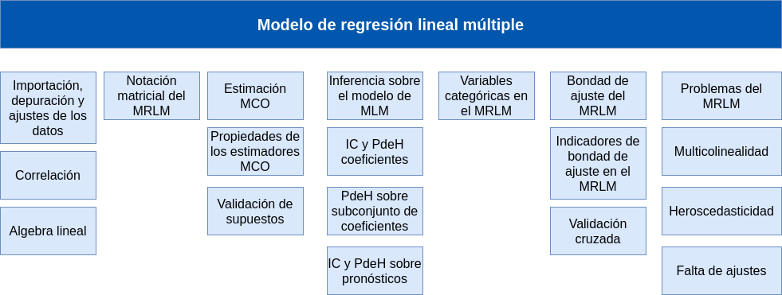

```{r setup, include=FALSE}
library(learnr)
library(paqueteMODELOS)
library(boot)
library(ggplot2)
library(gridExtra)
library(knitr)
library(broom)
library(stargazer)
library(ROSE)
library(tidyverse)
data(corazon)
data("train")
data("test")
data("train.blc")
data("test.blc")

knitr::opts_chunk$set(echo = FALSE,
exercise.warn_invisible = FALSE)
# colores
c1="#FF7F00" # NARANJA COLOR PRINCIPAL
c2="#034a94" # AZUL FUERTE COLOR SECUNDARIO  
c3="#0eb0c6" # AZUL CLARO COLOR TERCEARIO  
c4="#686868" # GRIS COLOR TEXTO 
##  <div class="content-box-blue">    </div> ## caja azul
```

## **PRESENTACIÓN**

```{r, echo=FALSE, out.width="100%", fig.align = "center"}
knitr::include_graphics("images/modulo1.png")
```


El presente tutorial contiene preguntas relacionadas con l estimación del modelo y sus supuestos, conceptos importante para la compresión los proceso relacionados con la inferencia realizada sobre los resultados obtenidos por el método de MCO.   

</br>

### **CONCEPTOS**

##### **Variable Dependiente Binaria**: 

En el modelo logit, tienes una variable dependiente binaria, denotada comúnmente como \(Y\), que toma uno de dos valores posibles, generalmente 1 para el evento de interés (éxito) y 0 para el evento contrario (fracaso).

##### **Función Logit**: 

El corazón del modelo logit es la función logit, que relaciona la probabilidad de éxito con una combinación lineal de las variables independientes. La función logit se define como \( \ln\left(\frac{p}{1-p}\right) \), donde \(p\) es la probabilidad de éxito.

##### **Variables Independientes**: 

El modelo logit también incluye variables independientes (predictores o covariables), denotadas comúnmente como \(X\). Estas variables explicativas se utilizan para predecir la probabilidad de éxito.

##### **Coeficientes del Modelo**: 

El modelo logit estima coeficientes para cada variable independiente en la ecuación logit. Estos coeficientes indican cómo influyen las variables independientes en la probabilidad de éxito. Un coeficiente positivo aumenta la probabilidad de éxito, mientras que un coeficiente negativo la disminuye.

##### **Probabilidad de Éxito**: 

El modelo logit permite calcular la probabilidad estimada de éxito para cualquier conjunto dado de valores de las variables independientes utilizando la función logit inversa (también conocida como la función sigmoide): \(p = \frac{e^{\beta_0 + \beta_1X_1 + \beta_2X_2 + \ldots + \beta_kX_k}}{1 + e^{\beta_0 + \beta_1X_1 + \beta_2X_2 + \ldots + \beta_kX_k}}\).

##### **Estimación de Parámetros**: 

Los coeficientes \(\beta\) del modelo logit se estiman mediante técnicas estadísticas, como la máxima verosimilitud, para encontrar los valores que mejor ajustan los datos observados.

##### **Bondad de Ajuste**: 

La bondad de ajuste del modelo logit se evalúa utilizando diversas métricas, como la devianza, la pseudo R-cuadrada y el test de Wald, para determinar qué tan bien se ajusta el modelo a los datos.

##### **Predicción y Clasificación**: 

El modelo logit se utiliza comúnmente para predecir la probabilidad de que ocurra un evento y para clasificar observaciones en función de su probabilidad estimada. Se puede establecer un umbral para clasificar las observaciones en las categorías de éxito y fracaso.

##### **Supuestos del Modelo**: 

Los supuestos clave del modelo logit incluyen la linealidad en logit, la independencia de errores, la falta de colinealidad entre las variables independientes y la ausencia de valores atípicos.

El modelo logit es ampliamente utilizado en diversas disciplinas, como la economía, la epidemiología, la ciencia política y la investigación de mercado, cuando se trata de analizar y predecir eventos binarios. Ayuda a comprender cómo las variables independientes afectan la probabilidad de ocurrencia de un evento particular.

<br/><br/>

### **Modelo**


$$Y = \beta_{0} + \beta_{1}X_{1} + \varepsilon$$


Donde la variable $Y$ es una variable con dos categorías (binaria), la variable $X$ corresponde a una variable numérica y $\varepsilon$ corresponde a una variable aleatoria no observable.


<br/><br/>

#### **Estimación**

Su estimación se puede plantear de manera resumida como:


$$\ln \Bigg(\dfrac{P_{i}}{1-P_{i}} \Bigg) = \ln (Odds) =\beta_{0} + \beta_{1} \hspace{.2cm}x_{i} + \varepsilon_{i}^{*}$$

<br/><br/>

### **Interpretación de los resultados**


</br>

* $\ln(odds) = \ln \Bigg(\dfrac{P_{i}}{1-P_{i}} \Bigg) = \ln \Bigg(\dfrac{P(Y=k|X=x)}{1-P(Y=k|X=x)}\Bigg)$

</br>

* $\ln \Bigg(\dfrac{1}{0}\Bigg) \hspace{.5cm}\text{si el caso se clasifica como exitoso}$

</br>

* $\ln \Bigg(\dfrac{0}{1}\Bigg) \hspace{.5cm}\text{si el caso se clasifica como fracaso}$

</br></br>


El resultado se puede interpretar como:

</br>

|    |                  |          |                                      |           |                |
|:---|:-----------------|:---------|:-------------------------------------|-----------|:---------------|
| Si |$P_{i} = 1-P_{i}$ | entonces |$\dfrac{P_{i}}{1-P_{i}} = Odds =1$,   | por tanto | $\ln(Odds) = 0$|     
|    |                  |          |                                      |           |                |
| Si | $P_{i} < 1-P_{i}$| entonces | $\dfrac{P_{i}}{1-P_{i}} = Odds < 1$,| por tanto | $\ln(Odds) < 0$|      
|    |                  |          |                                      |           |                |
| Si | $P_{i} > 1-P_{i}$| entonces | $\dfrac{P_{i}}{1-P_{i}} = Odds > 1$, | por tanto |$\ln(Odds) > 0$ |     


</br></br>

### **MAPA** 


```{r, echo=FALSE, , out.width="100%", fig.align = "center"}
#   

```


</br></br>

### **CÓDIGO R**

| concepto                   | código                                             |
|:---------------------------|:---------------------------------------------------|
| balance de categorías      | `ovun.sample(y~., data=train, p=0.5, seed=1,method="over")$data` |
| estimacion                 | `glm(y ~  x1 +x2 + x3, data = datos, family = binomial)`|
| visualización resultados   | `summary(modelo)`                                  |
| selección de variables     | `modelo_stepwise <- step(modelo_completo, direction = "forward")`|
| predicción de y            | `predict(modelo, nuevos_datos, type = "response")` |
| evaluación                 | `confusionMatrix(data, nivel_pronosticado, y)`     |
| curva ROC                  | `roc(test$y, valor_pronosticado)`                  |
| AUC                        | `auc(curva_ROC, levels =c(0,1), direction = "<")`  |

## **CUESTIONARIO**


### **Pregunta 1**  

```{r quiz_1}  

quiz(  
  question("¿Cuáles son los requisitos entorno a las variables en un modelo regresión logística?",   
         correct = "Correcto!, .",
           allow_retry = TRUE,  
           answer("La variable dependiente debe ser dicotómica. Las variables independientes deben ser numéricas o categóricas. La relación entre las variables independientes y la variable dependiente debe ser lineal.", message = "Cerca, pero no...intentalo de nuevo!"),  
           answer("La variable dependiente debe ser continua. Las variables independientes pueden ser numéricas o categóricas. La relación entre las variables independientes y la variable dependiente no debe ser lineal.", message = "Nop...intentalo de nuevo!"),  
           answer("La variable dependiente debe ser continua. Las variables independientes pueden ser numéricas o categóricas. La relación entre las variables independientes y la variable dependiente debe ser lineal.", message = "Incorrecto. Intenta de nuevo!."),  
           answer("La variable dependiente debe ser dicotómica. Las variables independientes pueden ser numéricas o categóricas. La relación entre las variables independientes y la variable dependiente debe ser lineal.", correct = TRUE),  
           # Si no cambiamos estos textos en los botones, se mostrarán en Inglés    
           submit_button = "Enviar respuesta",  
           try_again_button = "Intentar de nuevo"),  
  # Si no ponemos un caption aparecerá la palabra Quiz en inglés.  
  caption = "Visualización"  
)  
```  


### **Pregunta 2**  

```{r quiz_2}  

quiz(  
    question("¿Cuál es la función de probabilidad utilizada en el modelo logit? ",   
             correct = "Correcto. La función logística se utiliza para modelar la probabilidad en el modelo logit. Esta función tiene forma de S.",   
             allow_retry = TRUE,  
             answer("función logaritmica", message = "Cerca, pero no...intentalo de nuevo!"),  
             answer("función logística", correct = TRUE),  
             answer("función normal", message = "Incorrecto. Intenta de nuevo!."),  
             answer("función exponencial", message = "Nop...intentalo de nuevo!"), 
             # Si no cambiamos estos textos en los botones, se mostrarán en Inglés    
             submit_button = "Enviar respuesta",  
             try_again_button = "Intentar de nuevo"),  
    # Si no ponemos un caption aparecerá la palabra Quiz en inglés.  
    caption = "Visualización"  
)  
```  


### **Pregunta 3**  

```{r quiz_3}  

  quiz(  
    question("¿Cúal es el corte c más frecuentemente utilizado en el modelo logit?",   
             correct = "Correcto !, El punto en el que la probabilidad de la variable dependiente es igual a 0,5. Esto impica tener categorías de la variable dependiente balanceadas",   
             allow_retry = TRUE,  
             answer("El punto en el que la probabilidad de la variable dependiente es igual a 1.", message = "Cerca, pero no...intentalo de nuevo!"),  
             answer("El punto en el que la probabilidad de la variable dependiente es igual a 0.", message = "Nop...intentalo de nuevo!"),  
             answer("El punto en el que la probabilidad de la variable dependiente es igual a 0,5.", correct = TRUE),    
             answer("El punto en el que la probabilidad de la variable dependiente es igual a -0,5." , message = "Incorrecto. Intenta de nuevo!."),
             # Si no cambiamos estos textos en los botones, se mostrarán en Inglés    
             submit_button = "Enviar respuesta",  
             try_again_button = "Intentar de nuevo"),  
    # Si no ponemos un caption aparecerá la palabra Quiz en inglés.  
    caption = "Visualización"  
)  
```  


### **Pregunta 4**  

```{r quiz_4}  

quiz(  
    question("¿Cuál es la diferencia entre la regresión lineal y la regresión logística?",   
             correct = "Correcto!, .",   
             allow_retry = TRUE,  
             answer("La regresión lineal se utiliza para predecir variables dependientes dicotómicas, mientras que la regresión logística se utiliza para predecir variables dependientes continuas.", message = "Cerca, pero no...intentalo de nuevo!"),  
             answer(" La regresión lineal se utiliza para predecir variables dependientes continuas, mientras que la regresión logística se utiliza para predecir variables dependientes dicotómicas.", correct = TRUE), 
             answer("La regresión lineal se utiliza para predecir variables dependientes ordinales, mientras que la regresión logística se utiliza para predecir variables dependientes nominales.", message = "Incorrecto. Intenta de nuevo!."),  
             answer("La regresión lineal se utiliza para predecir variables dependientes categóricas, mientras que la regresión logística se utiliza para predecir variables dependientes numéricas.",  message = "Nop...intentalo de nuevo!"),  
             # Si no cambiamos estos textos en los botones, se mostrarán en Inglés    
             submit_button = "Enviar respuesta",  
             try_again_button = "Intentar de nuevo"),  
    # Si no ponemos un caption aparecerá la palabra Quiz en inglés.  
    caption = "Visualización"  
)  
```  


### **Pregunta 5**  

```{r quiz_5}  

quiz(  
    question("¿Cómo se puede mejorar la bondad del ajuste de un modelo de regresión logística?",   
             correct = "Correcto!, .",   
             allow_retry = TRUE,  
             answer("Se puede mejorar la bondad del ajuste de un modelo de regresión logística seleccionando las variables independientes más relevantes.", correct = TRUE),   
             answer("Se puede mejorar la bondad del ajuste de un modelo de regresión logística seleccionando más variables independientes.", message = "No...intentalo de nuevo!"),  
             answer("Se puede mejorar la bondad del ajuste de un modelo de regresión logística ajustando los parámetros del modelo sin seleccionar variables independientes.", message = "Incorrecto. Intenta de nuevo!."),  
             answer("Se puede mejorar la bondad del ajuste de un modelo de regresión logística seleccionando menos variables independientes.", message = "Cerca, pero no...intentalo de nuevo!"), 
             # Si no cambiamos estos textos en los botones, se mostrarán en Inglés    
             submit_button = "Enviar respuesta",  
             try_again_button = "Intentar de nuevo"),  
    # Si no ponemos un caption aparecerá la palabra Quiz en inglés.  
    caption = "Visualización"  
)  
```  


### **Pregunta 6**  

```{r quiz_6}  

quiz(  
    question("¿Cómo se puede utilizar la regresión logística para clasificar datos?",   
             correct = "Respuesta y explicación!, .",   
             allow_retry = TRUE,  
             answer("Se puede utilizar la regresión logística para clasificar datos asignando a cada observación un valor de la variable dependiente que represente la clase a la que no pertenece.", message = "Cerca, pero no...intentalo de nuevo!"),  
             answer("Se puede utilizar la regresión logística para clasificar datos asignando a cada observación un valor de la variable dependiente que represente la probabilidad de que pertenezca a ninguna clase. 2", message = "No...intentalo de nuevo!"),  
             answer("Se puede utilizar la regresión logística para clasificar datos asignando a cada observación un valor de la variable dependiente que represente la clase a la que pertenece.", correct = TRUE),    
             answer("Se puede utilizar la regresión logística para clasificar datos asignando a cada observación un valor de la variable dependiente que represente la probabilidad de que pertenezca a todas las clases.", message = "Incorrecto. Intenta de nuevo!."), 
             # Si no cambiamos estos textos en los botones, se mostrarán en Inglés    
             submit_button = "Enviar respuesta",  
             try_again_button = "Intentar de nuevo"),  
    # Si no ponemos un caption aparecerá la palabra Quiz en inglés.  
    caption = "Visualización"  
)  
```  


## **PROBLEMAS** 


### **Problema 1** 

Una endidad financiera quiere utilizar la regresión logística para estimar un modelo que pueda predecir la probabilidad de que un cliente solicite un préstamo. Para ello cuenta con el registro de datos de sus clientes : 

* aceptación del ofrecimiento: 1: acepta, 0 = no acepta
* edad en años
* ingresos millone de pesos
* deuda en millones de pesos

Este código carga los datos loans y crea un modelo de regresión logística con las variables edad, ingresos, y deuda como variables independientes. El resumen del modelo muestra los coeficientes y la bondad del ajuste del modelo

```{r p1, exercise=TRUE, exercise.lines = 20}  
# Cargar los datos
loans <- data.frame(aceptado = c(1, 1, 0, 0, 1, 1, 1, 0, 0, 1),
               edad = c(25, 30, 35, 40, 25, 30, 35, 40, 45, 50),
               ingresos = c(5.0, 7.5, 9.30, 11.4, 5.7, 7.6, 9.5, 11.3, 13.2, 15.3),
               deuda =    c(1.0, 2.700, 3.6, 4.7, 1.5, 2.3, 3.8, 4.6, 6.5, 6.8))

```  


```{r p1-hint}  
# Cargar los datos
loans <- data.frame(aceptado = c(1, 1, 0, 0, 1, 1, 1, 0, 0, 1),
               edad = c(25, 30, 35, 40, 25, 30, 35, 40, 45, 50),
               ingresos = c(5.0, 7.5, 9.30, 11.4, 5.7, 7.6, 9.5, 11.3, 13.2, 15.3),
               deuda =    c(1.0, 2.700, 3.6, 4.7, 1.5, 2.3, 3.8, 4.6, 6.5, 6.8))
# Crear el modelo
modelo <- glm()

```  


```{r p1-solution}  
# Cargar los datos
loans <- data.frame(aceptado = c(1, 1, 0, 0, 1, 1, 1, 0, 0, 1),
               edad = c(25, 30, 35, 40, 25, 30, 35, 40, 45, 50),
               ingresos = c(5.0, 7.5, 9.30, 11.4, 5.7, 7.6, 9.5, 11.3, 13.2, 15.3),
               deuda =    c(1.0, 2.700, 3.6, 4.7, 1.5, 2.3, 3.8, 4.6, 6.5, 6.8))
# Crear el modelo
modelo <- glm(aceptado ~ edad + ingresos + deuda, data = loans, family = "binomial")
# Resumen del modelo
summary(modelo)
```  


### **Problema 2**  

Un centro médico quiere desarrollar un modelo para predecir la probabilidad de que un paciente sufra un infarto. El centro tiene datos sobre los pacientes, incluyendo su edad, actividad física, historial de angina, y presión arterial.

El centro médico quiere utilizar la regresión logística para estimar un modelo que pueda predecir la probabilidad de que un paciente sufra un infarto.

Como primer paso requiere que seleccione una parte de la data equivalene al 60% (train) para desarrollar el modelo y el resto para realizar la evaluación del mismo (test).


```{r p2, exercise=TRUE, exercise.lines = 30}  
library(paqueteMODELOS)
data(corazon)

```  


```{r p2-hint}  
library(paqueteMODELOS)
data(corazon)

```  


```{r p2-solution}  
library(paqueteMODELOS)
library(ROSE)
data(corazon)
table(corazon$infarto)
# separacion de muetras
ntrain <- nrow(corazon)*0.6
ntest <- nrow(corazon)*0.4

set.seed(123)
index_train<-sample(1:nrow(corazon),size = ntrain)
train<-corazon[index_train,]  # muestra de entrenamiento
test<-corazon[-index_train,]  # muestra de prueba

```  


### **Problema 3**  

Como el resultado del anterior proceso no corresponde a una base balanceada (proporciones iguales o similares de la variables respuesta (infarto) se propone realizar un balanceo de las bases utilizando para ello la función `ovun.sample` del paquete  `ROSE`

<br/>

#### <span style="color:#FF7F00">**Nota**</span>

Debido a problemas con la memoria cache donde se alojas los objetos, para los siguientes ejercicios se coloca la solución final para que sean corridas en los computadores personales.


<pre>
library(paqueteMODELOS)
library(ROSE)
data(corazon)
table(corazon$infarto)
#-----------------------------
library(learnr)
load("data.RData")
#------------------------------

# separacion de muetras
ntrain <- nrow(corazon)*0.6
ntest <- nrow(corazon)*0.4

set.seed(123)
index_train<-sample(1:nrow(corazon),size = ntrain)
train<-corazon[index_train,]  # muestra de entrenamiento
test<-corazon[-index_train,]  # muestra de prueba

# oversampling
train.blc <- ovun.sample(infarto~., data=train, 
                         p=0.5, seed=1, 
                         method="over")$data

test.blc <- ovun.sample(infarto~., data=test, 
                        p=0.5, seed=1, 
                        method="over")$data
table(train.blc$infarto)
table(test.blc$infarto)

</pre>


### **Problema 4**  

A partir del resultado anterior tome la data train.blc y estime el modelo correspondiente 


<pre>

library(paqueteMODELOS)
library(ROSE)
data(corazon)
table(corazon$infarto)
# separacion de muetras
ntrain <- nrow(corazon)*0.6
ntest <- nrow(corazon)*0.4

set.seed(123)
index_train<-sample(1:nrow(corazon),size = ntrain)
train<-corazon[index_train,]  # muestra de entrenamiento
test<-corazon[-index_train,]  # muestra de prueba

# oversampling
train.blc <- ovun.sample(infarto~., data=train, 
                         p=0.5, seed=1, 
                         method="over")$data

test.blc <- ovun.sample(infarto~., data=test, 
                        p=0.5, seed=1, 
                        method="over")$data
glm(infarto ~ edad + angina + presion , family = binomial(link = "logit"), data = train.blc) -> modelo1

</pre>

### **Problema 5**  

Finalmete se requiere evaliar el modelo utilizando para ello la base test

<pre>

library(paqueteMODELOS)
library(ROSE)
data(corazon)
table(corazon$infarto)
# separacion de muetras
ntrain <- nrow(corazon)*0.6
ntest <- nrow(corazon)*0.4

set.seed(123)
index_train<-sample(1:nrow(corazon),size = ntrain)
train<-corazon[index_train,]  # muestra de entrenamiento
test<-corazon[-index_train,]  # muestra de prueba

# oversampling
train.blc <- ovun.sample(infarto~., data=train, 
                         p=0.5, seed=1, 
                         method="over")$data

test.blc <- ovun.sample(infarto~., data=test, 
                        p=0.5, seed=1, 
                        method="over")$data
glm(infarto ~ edad + angina + presion , family = binomial(link = "logit"), data = train.blc) -> modelo1


# matriz de confucion
valor_pronosticado <- predict(modelo1,test.blc,type = "response")
niveles_pronosticados <- ifelse(valor_pronosticado >0.5, "Si","No") %>%
  factor(.)

confusionMatrix(niveles_pronosticados, test.blc$gana )

</pre>
